# Local File Managment System (V1.1.0) Law Firm Version
This is a File Management System (FMS), built with Node.js designed to organize, manage, and facilitate access to files across multiple devices(clients) locally. It also supports file search functionality, ideal for small offices and teams. 

##  Quick-Start
-   Clone the repository, `git clone <repository-url>`
-   Navigate to the project directory and install dependencies, `npm install`
-   Run the server, `node server.js`
>   Note: This project requires a few dotenv variables.  To see what to include in your .env file click [here](#dotenv)
-   You will need to install Mongobd Compass. 

## Content
1.  [Overview](#overview)
2.  [Build Stack](#build-stack)
    - [Dotenv](#dotenv)
3.  [Folder Organization](#folder-organization)
4.  [Features](#features)
    - [Authentican And Authorization](#authentication-and-authorization)
5.  [Setting Up Local Server](#setting-up-local-server)
    - [Windows Task Scheduler ](#windows-task-scheduler )
    - [IP Router Setup](#ip-router-setup)
6.  [Bonus Setting up Google Auth](#Bonus-Setting-up-Google-Auth)

## Overview
This app is a file management system. V1.1.0 is built specifically for Law Firms, a general template version for other small businesses will be made available on another branch.

This app runs locally on the server, and uses a server's storage to store files. The files can also be downloaded on other client machines. The rest of the features will be discussed in the [Features](#features) section. 

## Build Stack
-   Node.js
-   Express 
-   Mongodb (Database):
    Mongodb compass will have to run automatically on every boot up of your system. To ensure it does this follow the following steps:
    1.  On your windows search bar, search for services and open it.
    2.  Search for MongoDB Server on the list of services and click on it.
    3.  Change the Startup type to Automatic.
    4.  Click Apply and OK.
    5.  If the service isn't already running click on Start the service.
>   Dependencies: Find a list of dependencies in the package.json file

### Dotenv
-   PORT 
    > 3000 will work fine 
-   OFFICECODE
    > Create a code for your office or team to enable only members from your office/team to sign up and access your files, e.g. `OFFICECODE = "0824635"`
-   DATABASEURL
    > Mongodb connection string
-   SECRET
    > Jwt secret. Make sure to use a long string.
-   PARENTDIR
    > Parent folder directory for file storage on your server, e.g. `PARENTDIR = "C:\Users\Username\Documents\FMS-STORAGE"`
-   EMAIL
    > Nodemailer is used in the project for sending emails. Feel free to disreqard any feature requiring emails. But provide an email that will act as a sender if you choose to use it. 
-   EPASSWORD 
    > The email password should be included
-   HOST
    > This might be required depending on your email service provider. For more details on Nodemailer visit the [Nodemailer Website](https://nodemailer.com/)

## Folder Organization
For this version (Law Firm) the folder structure follows this path: 
>   PARENT-DIRECTORY/TYPE-OF-CASE/YEAR/COURT/SUIT-NUMBER/FILE-NAME

For other versions a custom folder structure will be used

## Features
1. Home page with a list of folders that contain the documents/files. 
<!-- 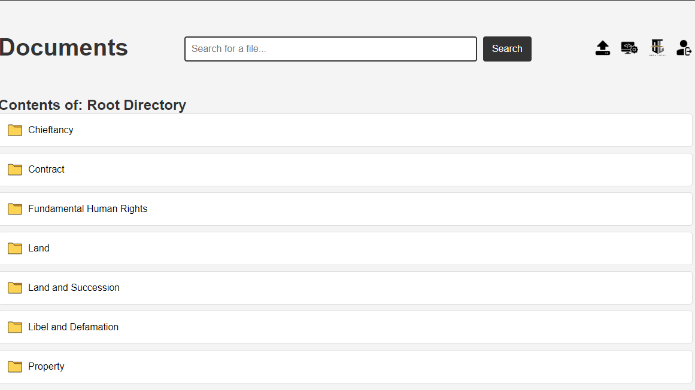 -->
2. Download functionality available to download files. 
<!-- 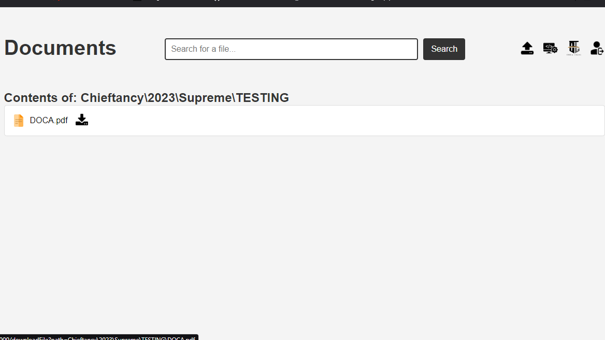 -->
3. Search functionality. 
<!-- 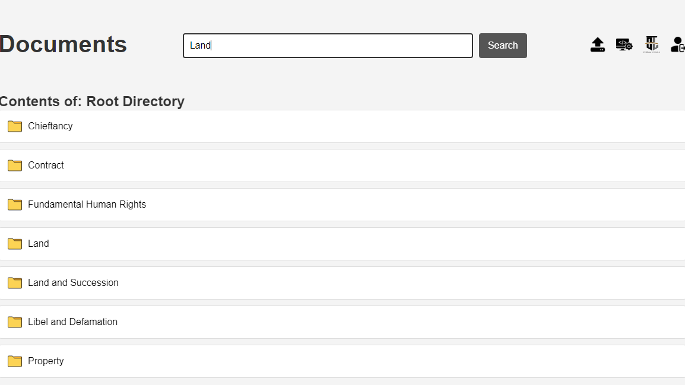 -->
4. Upload form to upload files. 
<!-- 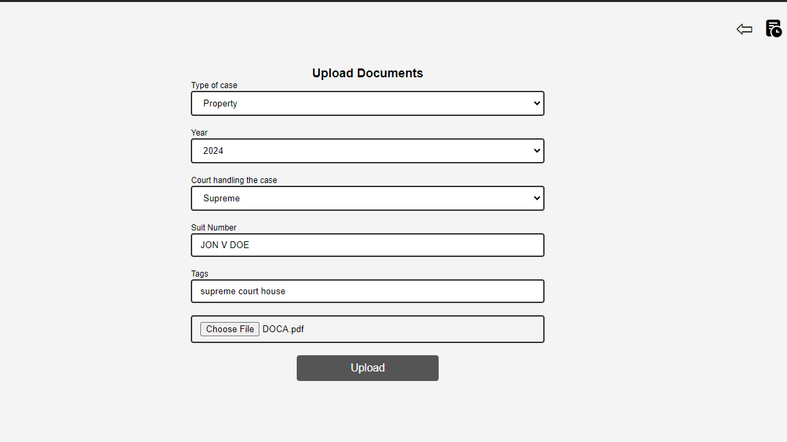 -->
5. Document/File history to see history of uploaded documents 
<!-- 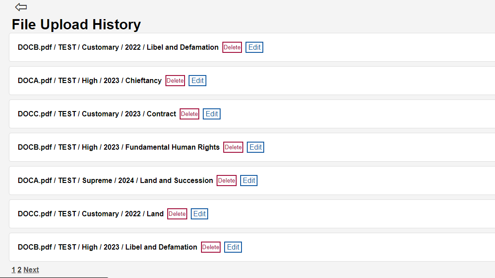 -->
6. Edit and delete functionality for files. 
<!-- 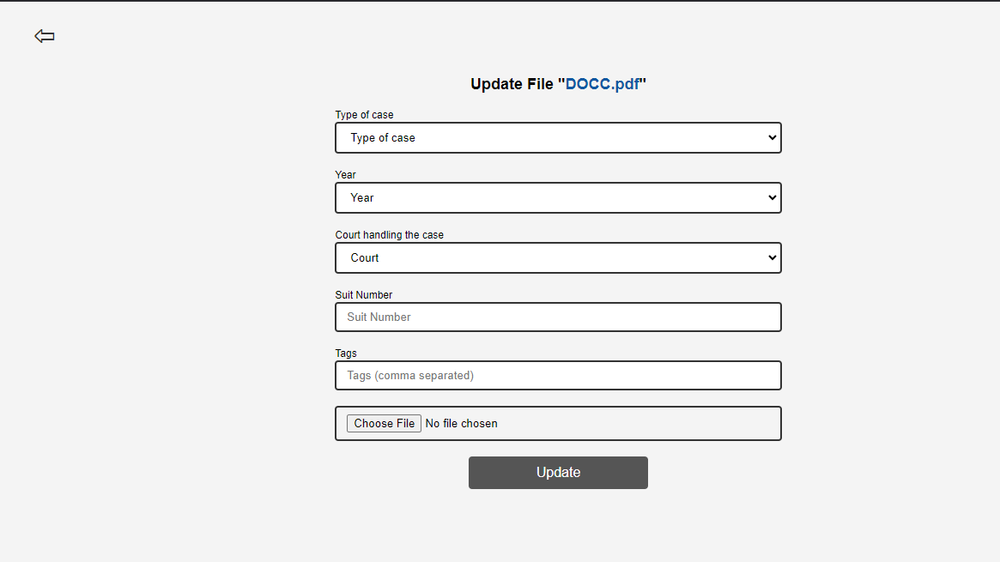 -->
<!-- 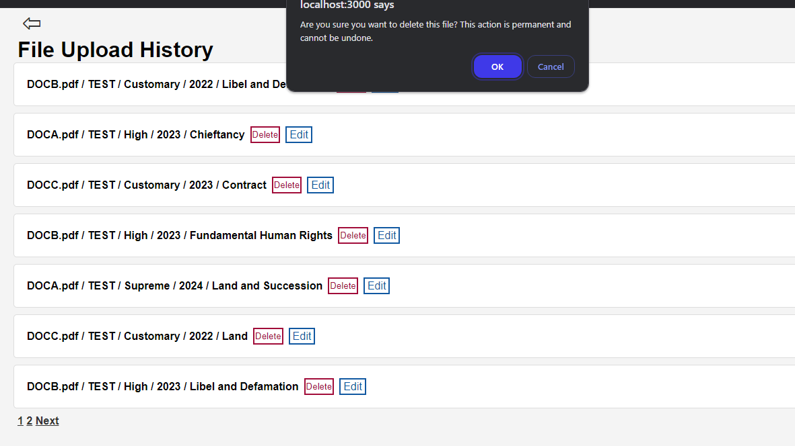 -->

### Authentication And Authorization
This app uses the basic jwt auth strategy. 
It has 3 levels of authorization which can be customized to include more. 
1. verifyStaff

    Basic auth function to verify users are logged in and staff of the office. 
2. verifyStaffAndAdmin

    Auth function to check if user is Admin. For routes that require Admin priveledges like upload and update routes. 
3. verifyStaffAdminAndSuperAdmin

    SuperAdmin route to check if user is a SuperAdmin for special routes that require SuperAdmin access. 

## Setting Up Local Server
### Windows Task Scheduler 
After installing node and mongodb compass, as well as basic setup, You'll need to turn your local computer into a server. 

To do this, you will be using Windows Task Scheduler to start up your server every time your windows machine is turned on. To do this, follow the following steps:

1. Set up a password for your computer: 
  
-  Set up a basic password for your computer. This will come in handy in later steps. 

2. Create a batch script to run your server:

-  Create a .bat file to automate starting the server
-  Open Notepad and add the following script:
>  @echo off

>  cd "C:\path\to\your\project" // Change this to the path where your `server.js` is located

>  node server.js

3. Save this file as start-server.bat (or any name) on your desktop or any folder.

4. Open Task Scheduler:

-   Press Win + R and type taskschd.msc, then press Enter.

5. Create a new task:

-   Click Create Task in the right panel.
-   In the General tab, give the task a name (e.g., "Start Node.js Server").
-   Select "Run whether user is logged on or not" and check "Run with highest privileges".

6. Set the trigger (when to start the server):

-   Go to the Triggers tab and click New.
-   Set Begin the task to "At startup" and click OK.

7. Set the action (run the server):

-   Go to the Actions tab and click New.
-   In the Action field, select "Start a program".
-   Under Program/script, browse to the location of your start-server.bat file and select it. Click OK.

8. Save the task:

-   Click OK and enter your administrator password (if prompted) This would be the password you set up in [step 1](#windows-task-scheduler)

### IP Router Setup
To connect other clients to the server locally, both clients and servers should be connected on the same network. Ideally this should be done using a router, so that the connection url for other clients will be `http://IP-ADDRESS-OF-SERVER:3000` 

The IP Address of the server changes dynamically on every reconnection to the router. Therefore, to avoid this and give the server connection string a constant url, you will have to assign the server a static IP Adress

This process varies among different routers but the basic idea is the same. In this case, we will be using a Digicom Router to set up: 

> make sure your server is connected to the router before proceeding with this step

1. Navigate to the web interface of the router using the defualt gateway:

    You can find this gateway written on the rouer or you can navigate to your control panel > network and sharing center > active network 

    Clicking on the active network will bring out details of the network. You can then copy the connection string onto a browser. Then log in using the default username and password. 
    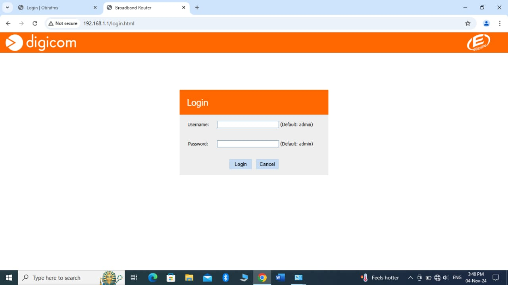

2. Navigate to advanced settings and LAN/Network settings
    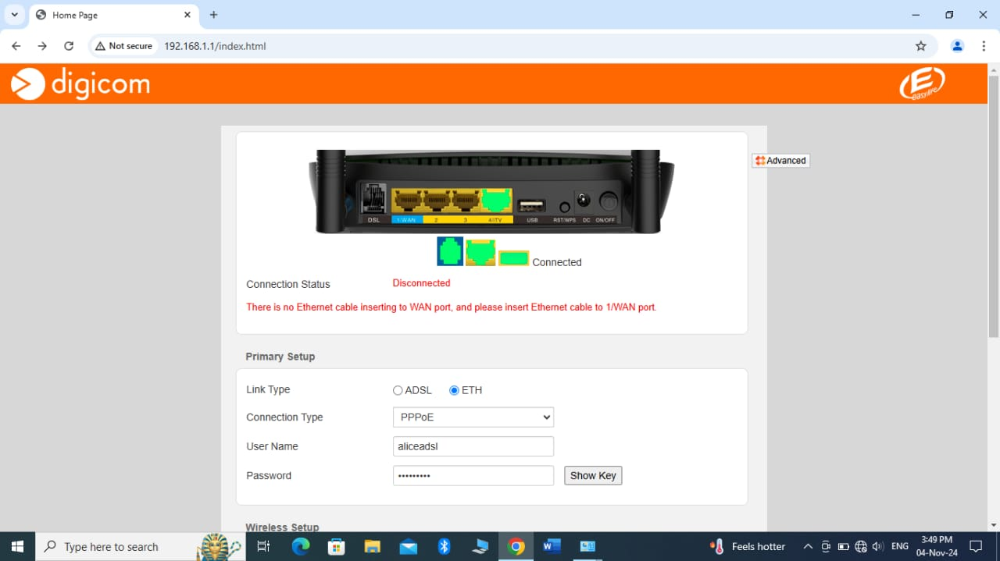
    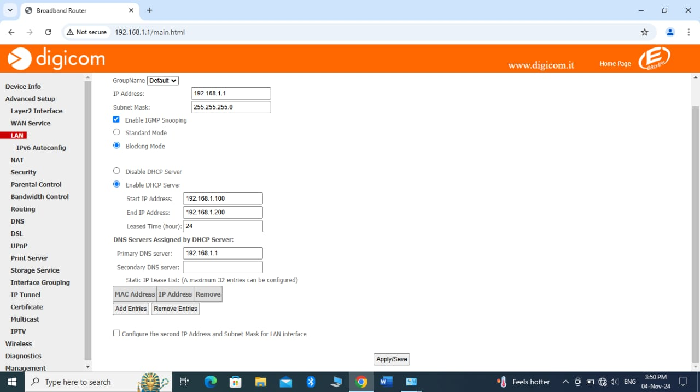

3. Click on reserve static IP or whatever is analogous to it depending on your router, here it says Add Entries under Static IP Lease
    

4. You'll be prompted to write the MAC Address of your server and the Static IP Address you want to assign your server. 
    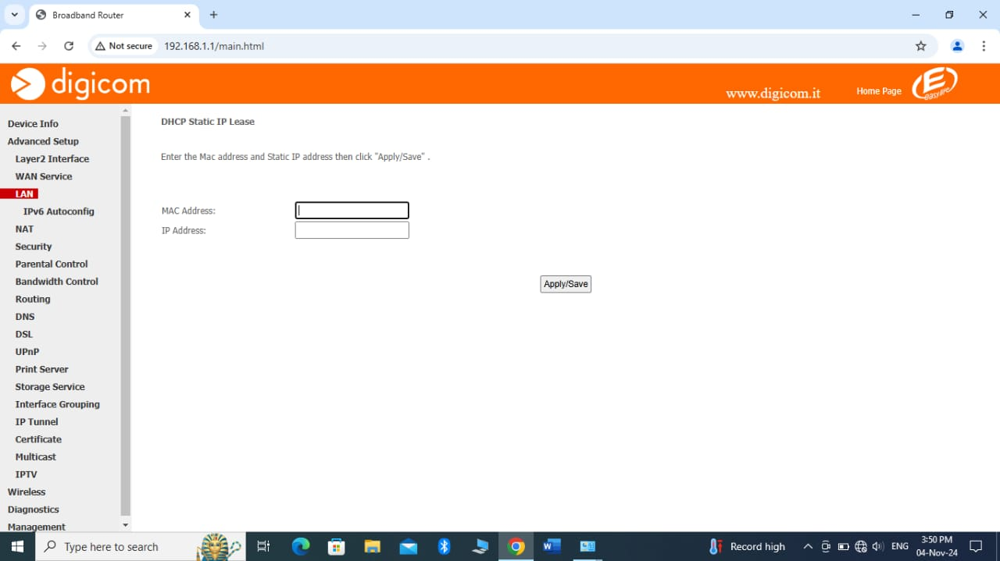

To find your MAC addess, navigate to your control panel > network and sharing center > active network. Clicking on the active network will bring out details of your network and PC including the Mac address (Physical Address)
    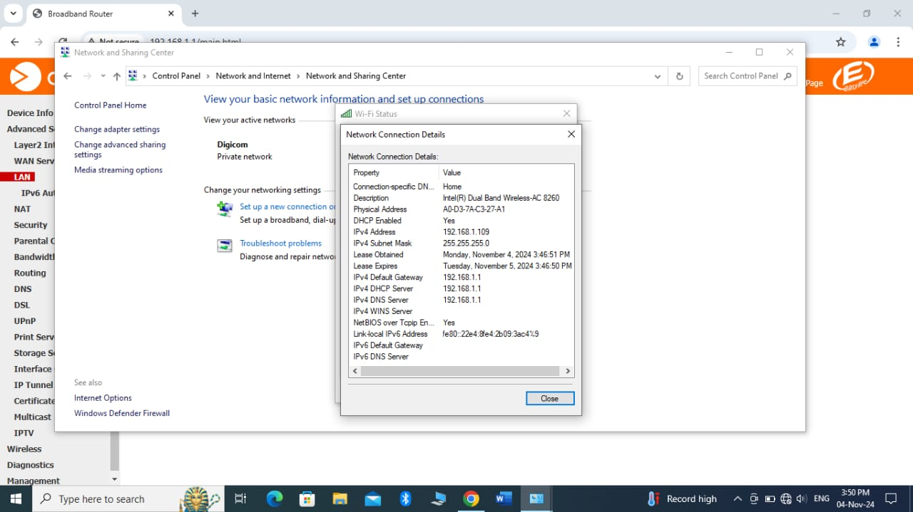

For the Static IP address you'll chose, it's best to just change the last 3 numbers of your cureent IP Adress i.e 192.168.1.100

5. After inputting the details click on Apply/Save. And now, your server will use the same IP Address whenever it is connected to the router.
    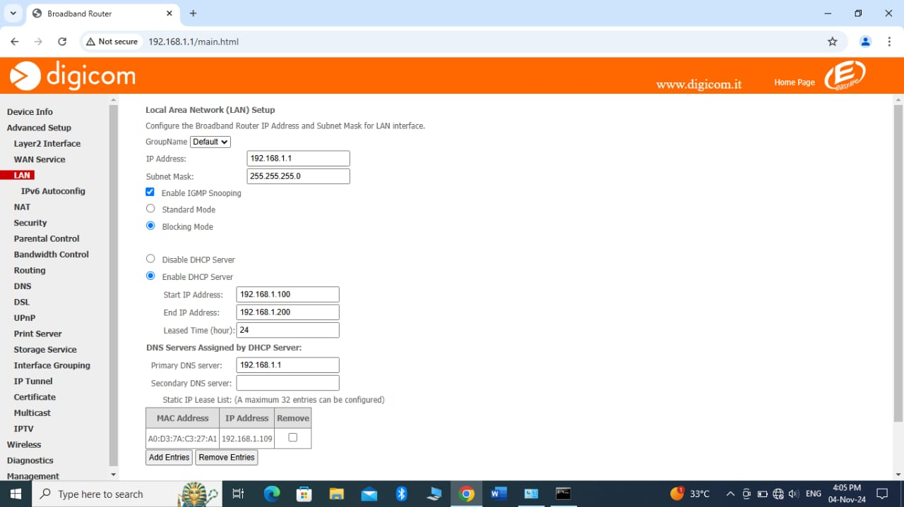

## Bonus Setting up Google Auth 

#### Pre-requisites (npm packages that'll be used)
- passport
- passport-google-oauth20
- express-session

### Google Cloud Console Set-up 
1. First set up your application in google's cloud console. Go to [Google Cloud Console](https://console.cloud.google.com)
2. Click `select a project` on the top bar and then create a new project. Then select that project. 
3. On the menu bar click on `APIs and Services` and then `Oauth Consent Screen` to configure your Consent Screen. Make sure your Audience is set to `External` 
4. Next, create an OAuth Client for the project, the button to create one should be immediately visible. Click on it. 
- Select your application type (Web). 
- Add an authorized javascript origin or origins i.e `http://localhost:3000`
- Add an authorized redirect url. That is the URL to redirect to after authentication i.e `http://localhost:3000/auth/google/callback`
- Download your credentials and add the client ID and Secret to your .env file. 
