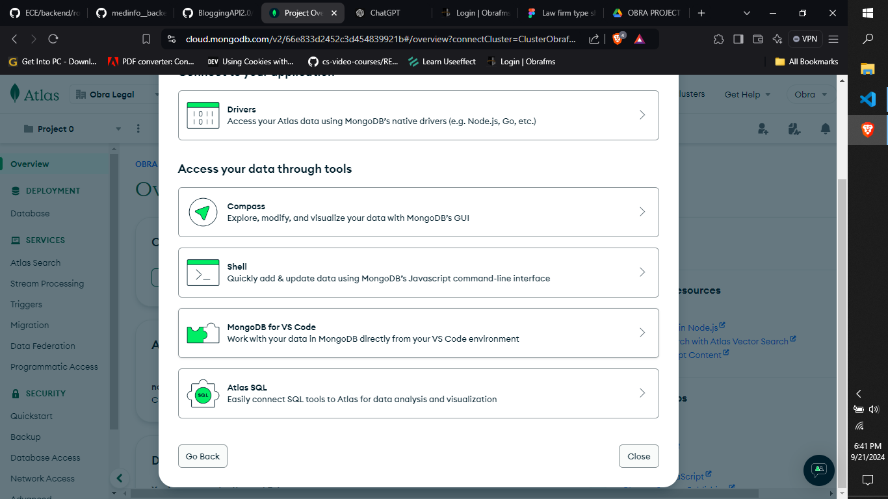

# Local File Managment System (V1.0.0)
This is a File Management System (FMS), built with Node.js designed to organize, manage, and facilitate access to files across multiple devices(clients) locally. It also supports file search functionality, ideal for small offices and teams. 

##  Quick-Start
-   Clone the repository, `git clone <repository-url>`
-   Navigate to the project directory and install dependencies, `npm install`
-   Run the server, `node server.js`
>   Note: This project requires a few dotenv variables.  To see what to include in your .env file click [here](#dotenv)

## Content
1.  [Overview](#overview)
2.  [Build Stack](#build-stack)
    - [Dotenv](#dotenv)
5.  [Features](#features)
4.  [Setting Up Local Server](#setting-up-local-server)
    - [Windows Task Manager](#windows-task-manager)
    - [IP Router Set-up](#ip-router-setup)

## Overview
This app is a file management system...to be continued

## Build Stack
-   Node.js
-   Express 
-   Mongodb (Database)
>   Dependencies: Find a list of dependencies in the package.json file

### Dotenv
-   PORT 
    > 3000 will work fine 
-   OFFICECODE
    > Create a code for your office or team to enable only members from your office/team to sign up and access your files, e.g. `OFFICECODE = "0824635"`
-   DATABASEURL
    > Mongodb connection string
-   SECRET
    > Jwt secret. Make sure to use a long string.
-   PARENTDIR
    > Parent folder directory for file storage on your server, e.g. `PARENTDIR = "C:\Users\Username\Documents\FMS-STORAGE"`
-   EMAIL
    > Nodemailer is used in the project for sending emails. Feel free to disreqard any feature requiring emails. But provide an email that will act as a sender if you choose to use it. 
-   EPASSWORD 
    > The email password should be included
-   HOST
    > This might be required depending on your email service provider. For more details on Nodemailer visit the [Nodemailer Website](https://nodemailer.com/)

<!--   -->

 
